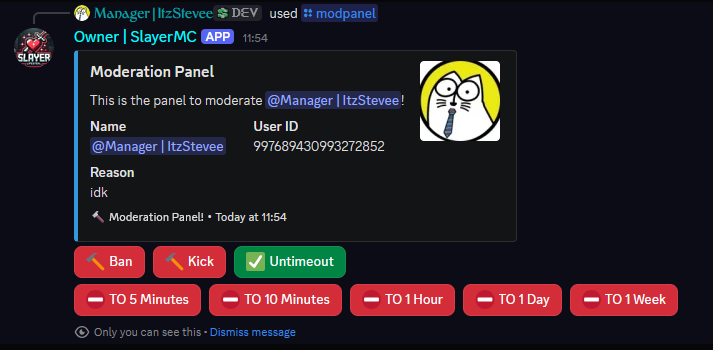
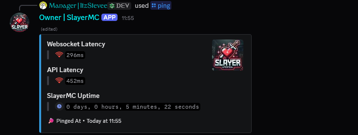
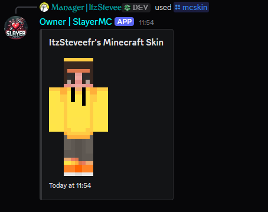
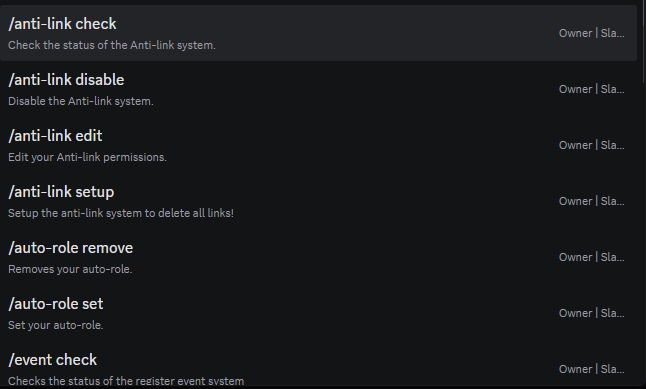
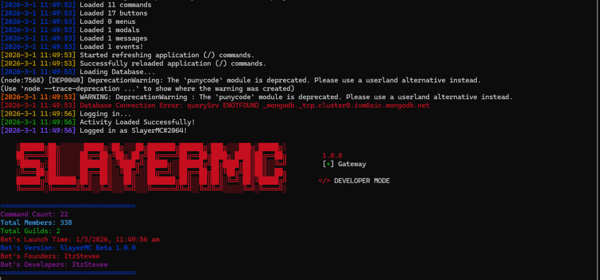

# SlayerMC Discord Bot

A modular Discord bot built for Minecraft communities, with server moderation, onboarding, utility tools, and community systems.

## Overview

SlayerMC is designed to help server staff run a safe and engaging Discord server. It combines:

- **Moderation workflows** (mod panel, reports, anti-link, auto moderation)
- **Onboarding automation** (welcome channels, auto-role, verification)
- **Community features** (suggestions and event registration)
- **Minecraft utilities** (server status and skin lookup)

## Core Systems

### 1) Moderation & Safety
- **Auto Moderation Event**: Detects blocked words/links, deletes flagged messages, and sends log embeds.
- **Anti-Link System**: Setup, disable, check, and edit link filtering and bypass permissions.
- **Moderation Panel**: Staff panel with interactive moderation controls.
- **Report System**: Structured reports for bugs, servers, and users.

### 2) Member Onboarding
- **Welcome Channel System**: Configure a channel where join messages are sent.
- **Auto-Role System**: Automatically apply a configured role to new members.
- **Verify System**: Verification flow with role assignment using button interactions.

### 3) Community Features
- **Suggestion System**: Setup/disable suggestions, submit suggestions, and manage voting with buttons.
- **Event Registration System**: Setup/check/disable event registration and collect entries through modal forms.

### 4) Minecraft Utilities
- **Minecraft Server Status**: Check if a server is online and optionally view detailed server information.
- **Minecraft Skin Lookup**: Fetch a player's Minecraft skin/avatar by username.

## Slash Commands

| Command | Description | Key Subcommands / Options |
|---|---|---|
| `/ping` | Returns bot latency. | — |
| `/modpanel` | Opens an interactive moderation panel for a target user. | `target`, `reason` |
| `/report` | Reports bugs/server issues/users to staff. | `bug`, `server`, `user` |
| `/mcstatus` | Retrieves Minecraft server status. | `ip`, `detailed` |
| `/mcskin` | Gets a player's Minecraft skin. | `user` |
| `/verify-setup` | Configures the verification embed/role flow. | `role`, `channel` |
| `/welcome-channel` | Manages welcome message channel. | `set`, `remove` |
| `/auto-role` | Manages automatic role assignment. | `set`, `remove` |
| `/anti-link` | Manages anti-link protection and bypass permission. | `setup`, `disable`, `check`, `edit` |
| `/event` | Manages the event registration system. | `setup`, `check`, `disable`, `registeration` |
| `/suggestion` | Suggestion board and voting system. | `setup`, `disable`, `submit` |

## Interactions & Components

- **Buttons**: verify, approve/reject suggestions, upvote/downvote, vote totals, moderation actions, timeout actions.
- **Modals**: event registration modal with structured fields.
- **Message Command**: `!ping` fallback message command support.

## Tech Stack

- **Node.js**
- **discord.js v14**
- **MongoDB + Mongoose**

## Project Structure

```text
commands/      # Slash command modules
buttons/       # Button interaction handlers
modals/        # Modal interaction handlers
events/        # Discord event listeners
schemas/       # MongoDB/Mongoose schemas
utils/         # Loaders, logging, database/bootstrap utilities
slayermc-assets/ # Project images and screenshots
```

## Setup (Local)

1. Install dependencies:
   ```bash
   npm install
   ```
2. Configure bot credentials/database (recommended: move secrets into environment variables).
3. Start the bot:
   ```bash
   node index.js
   ```

## Showcase

> Screenshots from `slayermc-assets`.

### Bot / System Screenshots







## Notes

- This repository currently includes dependencies in `node_modules/`; in most production workflows this folder is not committed.
- Keep bot token and database credentials private and rotate them if they were ever exposed.
